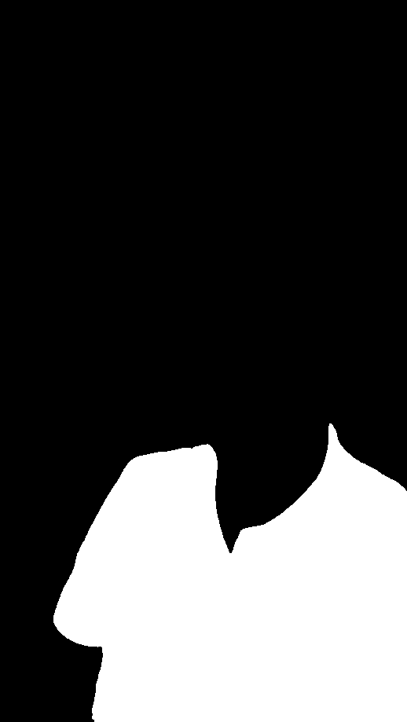

# Gen AI Portfolio Repository

A comprehensive collection of state-of-the-art AI models integrated into a single, cohesive library.

# Integrated Models

The library incorporates the following advanced AI models:

* Florence2
  * A versatile multimodal vision model supporting various computer vision tasks. Mainly used for zero-shot object detection.
* Segment Anything 2
  * An advanced segmentation model that precisely identifies and delineates objects within images. Used with Florence2 for zero-shot object masking.
* Stable Diffusion 1.5
  * A generative AI model specializing in high-quality image synthesis and manipulation.
* YOLOWorld
  * A real-time object detection model with configurable object categories.
* YOLOv11 Pose
  * A state-of-the-art human pose estimation model.
* LLaMA-Mesh
  * A 3D mesh generation model that creates OBJ files using a fine-tuned LLaMA 3.1 8B language model.
* Qwen-QwQ
  * An experimental research model developed by the Qwen Team, focused on advancing AI reasoning capabilities.

## Florence2

Florence2 represents a comprehensive multimodal vision model that excels in various computer vision tasks including image understanding, object detection, and visual captioning.

## Segment Anything 2

The Segment Anything 2 integration provides robust image segmentation capabilities. The model can precisely identify and isolate multiple objects within images, making it ideal for applications requiring detailed scene understanding and object isolation.

## Stable Diffusion 1.5

Stable Diffusion 1.5 provides advanced image generation and manipulation capabilities through three primary functionalities:

### Text-to-Image Generation

The text-to-image system generates high-quality images from textual descriptions. Users can control various generation parameters to achieve desired artistic styles and content characteristics.

### Image-to-Image Transformation

The image-to-image transformation system enables guided image modification based on textual prompts. This allows for sophisticated style transfers, content alterations, and image enhancements while preserving structural integrity.

### Inpainting

The inpainting system provides precise control over image editing by allowing selective regeneration of masked areas. This enables seamless object removal, addition, or modification within existing images.

## YOLOWorld

YOLOWorld implements real-time object detection with dynamic category support. The system can identify and localize multiple object categories within images, with support for custom category sets.

## YOLOv11 Pose

The YOLOv11 Pose integration enables precise human pose estimation, providing detailed skeletal keypoint detection and pose analysis.

## LLaMA-Mesh

LLaMA-Mesh is a model for generating 3D meshes in OBJ format using LLaMA language model. The model can create only one object at a time.

## Qwen-QwQ

# Features

## Stable Diffusion

### Prompt Weighting

Users can set weights of prompt parts using a syntax similar to AUTOMATIC1111's. To set weight of a prompt part, encapsulate the part within parentheses and use a colon and set weight value before closing the parenthesis. Check examples below.

```python
prompt = "An (oil painting:1.3) image depicting a (lake view at (sunset: 1.1): 1.3)"

from gen_ai.tasks.image_gen.clip.prompt_weighting import parse_prompt

parsed_prompt = parse_prompt(prompt)

>>> parsed_prompt
[
  Text Piece: 'An ', Attention Multiplier: 1.0,
  Text Piece: 'oil painting', Attention Multiplier: 1.3,
  Text Piece: ' image depicting a ', Attention Multiplier: 1.0,
  Text Piece: 'lake view at ', Attention Multiplier: 1.3,
  Text Piece: 'sunset', Attention Multiplier: 1.4300000000000002
]
```

# Examples

## Stable Diffusion 1.5 Inpainting

| Prompt                                              | Input Image                                      | Mask                                           | Result                                             |
| --------------------------------------------------- | ------------------------------------------------ | ---------------------------------------------- | -------------------------------------------------- |
| RAW photo of a man wearing a red and white fur coat |  |  |  |

# Installation

1. Install the package using `pip install -e .`
2. Install additional required repositories from the `repositories` folder
3. Refer to [RESOSITORIES.md](repositories/REPOSITORIES.md) for detailed setup instructions

## Quantized LLM Requirements

In order to run quantized LLMs, llama-cpp-python package is used. Command below can be used if you are using a CUDA machine. Please refer to llama-cpp-python[[GitHub](https://github.com/abetlen/llama-cpp-python)] package for other supported hardware accelerators.

```bash
CMAKE_ARGS="-DGGML_CUDA=on" pip install llama-cpp-python
```
